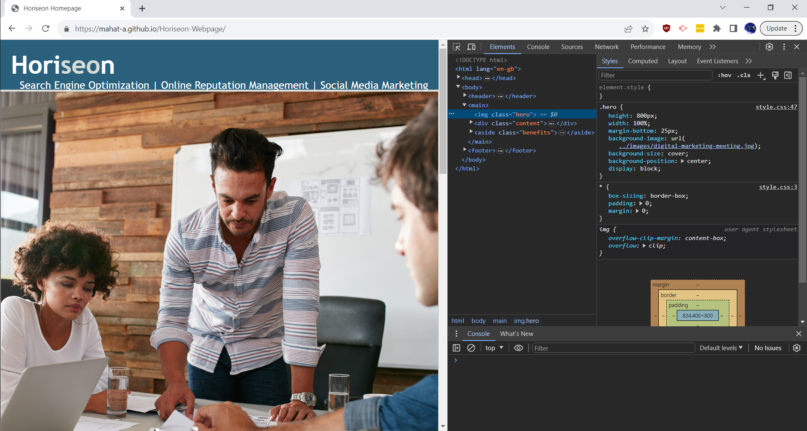

# Horiseon-Webpage

## Description
The purpose of this project was to build upon an existing website to meet standard accessibility criterias such as correct use of HTML semantics and use of alt attributes for image elements. 
# Installation
 N/A
## Usage

You can view the website with the link: https://mahat-a.github.io/Horiseon-Webpage/ aswell as the source code either here in the repository or using the developer tools on your selected browser.

## Credits
N/A
## License
Please refer to the LICENSE in the repo.
